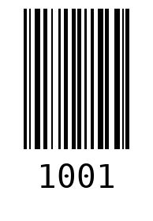

# 📦 Cloud-Integrated Barcode Inventory System

<p align="left">
  
  
  
</p>

## 📝 Project Overview
A standalone inventory management system developed to digitalize stock recording in real-time. This application integrates **Computer Vision** for barcode recognition with a cloud-based database using the **Google Sheets API**. It is designed for operational efficiency, featuring automation logic to prevent data duplication and streamline stock entry.

---

## 🛠️ Technical Stack
* **Core Language:** Python 3.12
* **Computer Vision:** `OpenCV` & `ZXing-CPP` (High-stability 1D/2D detection)
* **Cloud Integration:** `GSpread` (Google Sheets API) & `OAuth2Client`
* **Interface:** `Tkinter` (GUI Framework)
* **Utility:** `Python-Barcode` (Standard Code128 generation)

---

## 🚀 Step-by-Step Workflow

### 1. Generate Asset Barcodes
The first step is creating barcodes for new items. Users enter the Unique ID or Item Name, and the system generates a standard **Code128** barcode.

<table border="0">
  <tr>
    <td width="50%"><br/><sub><b>Generator UI:</b> Input unique item ID.</sub></td>
    <td width="50%"><br/><sub><b>Output:</b> Barcodes are automatically saved in the <code>/barcode</code> folder.</sub></td>
  </tr>
</table>

### 2. Cloud Database Setup (Google Sheets)
The system utilizes Google Sheets as a lightweight cloud database. The header row must be configured to ensure data synchronizes with the correct columns.

<p align="center">
  <br/>
  <sub><b>Column Structure:</b> Barcode Value, Last Update, Item Name, and Quantity.</sub>
</p>

### 3. Smart Scanning & Recognition
Users select a barcode image to scan. The system employs the **ZXing** engine to accurately extract data from the image.

<table border="0">
  <tr>
    <td width="50%"><br/><sub><b>Scan Process:</b> Uploading the barcode image file.</sub></td>
    <td width="50%"><br/><sub><b>Detection:</b> Barcode recognized; system verifies data against the cloud database.</sub></td>
  </tr>
</table>

### 4. Automated Inventory Sync
Once detected, the system executes the following logic:
- **New Entry:** Appends a new row to Google Sheets if the barcode is unregistered.
- **Existing Item:** Automatically increments the **Quantity (Qty)** by +1 on the corresponding row.

<p align="center">
  <br/>
  <sub><b>Final Result:</b> Success confirmation after cloud data synchronization.</sub>
</p>

---

## ⚙️ Implementation Steps

### 1. Google Cloud Configuration
1. Go to the [Google Cloud Console](https://console.cloud.google.com/).
2. Enable **Google Sheets API** and **Google Drive API**.
3. Create a **Service Account**, download the **JSON Key**, and save it as `credentials.json`.
4. Share your Google Sheet with the Service Account email as an **Editor**.

### 2. Installation
```bash
pip install gspread oauth2client opencv-python zxing-cpp python-barcode
