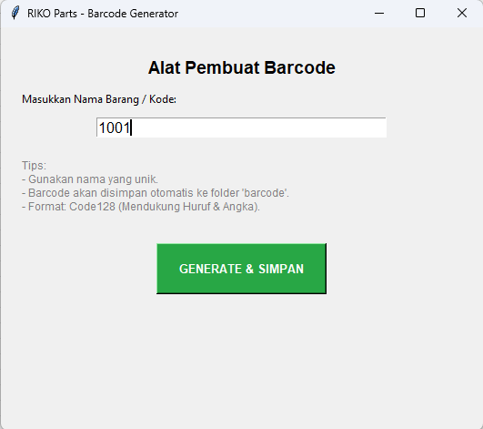
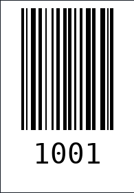
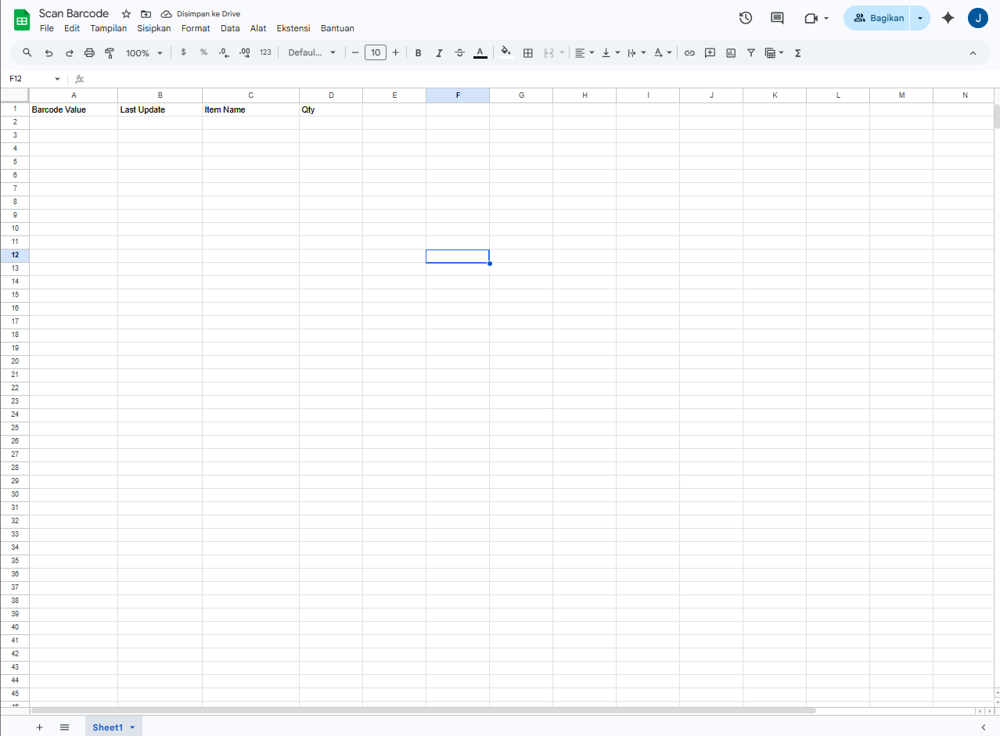
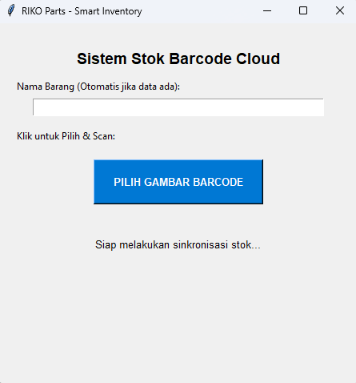
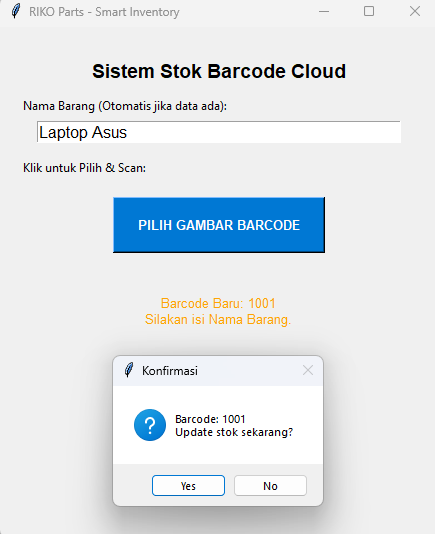
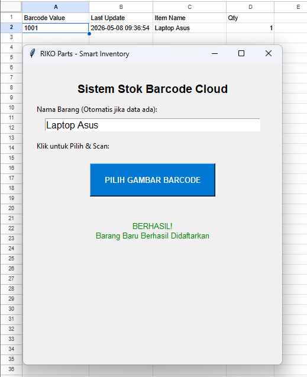

# 📦 Cloud-Integrated Barcode Inventory System

<p align="left">
  
  
  
</p>

## 📝 Project Overview
Sistem manajemen inventaris mandiri yang dikembangkan untuk mendigitalisasi pencatatan stok secara *real-time*. Aplikasi ini mengintegrasikan pengenalan gambar (Computer Vision) dengan database berbasis cloud menggunakan Google Sheets API. Sistem ini dirancang untuk efisiensi operasional dengan logika otomatisasi yang mencegah duplikasi data.

---

## 🛠️ Technical Stack
* **Core Language:** Python 3.12
* **Computer Vision:** `OpenCV` & `ZXing-CPP`
* **Cloud Integration:** `GSpread` (Google Sheets API)
* **Interface:** `Tkinter` (GUI Framework)

---

## 🚀 Step-by-Step Workflow

### 1. Generate Barcode Identitas Barang
Langkah pertama adalah membuat barcode untuk barang baru. Pengguna cukup memasukkan ID atau Nama Barang, dan sistem akan menghasilkan barcode standar Code128.

<table border="0">
  <tr>
    <td width="50%"><br/><sub><b>UI Generator:</b> Input ID unik barang.</sub></td>
    <td width="50%"><br/><sub><b>Output:</b> Barcode disimpan otomatis di folder <code>/barcode</code>.</sub></td>
  </tr>
</table>

### 2. Persiapan Database Cloud (Google Sheets)
Sistem menggunakan Google Sheets sebagai database. Baris pertama (Header) harus disiapkan agar data tersinkronisasi dengan kolom yang benar.

<p align="center">
  <br/>
  <sub><b>Struktur Kolom:</b> Barcode, Last Update, Item Name, dan Quantity.</sub>
</p>

### 3. Proses Scanning & Deteksi Pintar
Pengguna memilih gambar barcode yang ingin di-scan. Sistem menggunakan engine **ZXing** untuk membaca data dari gambar secara akurat.

<table border="0">
  <tr>
    <td width="50%"><br/><sub><b>Scan Process:</b> Memilih file gambar barcode.</sub></td>
    <td width="50%"><br/><sub><b>Detection:</b> Barcode terdeteksi dan sistem mengecek database.</sub></td>
  </tr>
</table>

### 4. Sinkronisasi & Update Stok Otomatis
Setelah barcode terdeteksi, sistem menjalankan logika:
- **Jika Barang Baru:** Menambah baris baru ke Google Sheets.
- **Jika Barang Lama:** Menambah jumlah Qty (+1) pada baris yang sama.

<p align="center">
  <br/>
  <sub><b>Final Result:</b> Konfirmasi sukses setelah data terkirim ke Cloud.</sub>
</p>

---

## ⚙️ Implementation Steps

### 1. Google Cloud Configuration
1. Buka [Google Cloud Console](https://console.cloud.google.com/).
2. Aktifkan **Google Sheets API** dan **Google Drive API**.
3. Buat **Service Account**, unduh Key dalam format **JSON**, dan simpan sebagai `credentials.json`.
4. Share Google Sheets Anda ke email Service Account tersebut sebagai **Editor**.

### 2. Installation
```bash
pip install gspread oauth2client opencv-python zxing-cpp python-barcode
